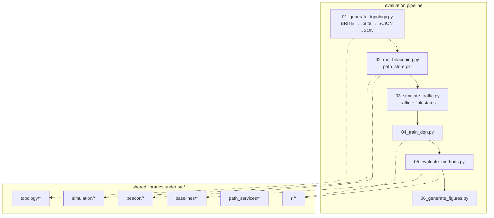

# Codebase walkthrough

This document explains how the **SCION DQN simulation** repository is structured, how major pieces talk to each other, and where to look when you extend or fix things. It reflects the tree as of this writing; some paths are still evolving (see [Known gaps](#known-gaps)).

---

## What this project is trying to do

1. **Build** an AS-level network topology via **BRITE** (Java) and convert it to a SCION-style graph in JSON.
2. **Approximate SCION control-plane behavior** (beaconing, path discovery) so you get candidate paths between ASes.
3. **Simulate traffic and link conditions** over time.
4. **Train and evaluate** a **DQN** (and **baselines**) for **path selection** under **selective probing** (different probe costs, not probing every path).

The code is organized in layers: **topology generation** (`src/topology/`, BRITE), **simulation + RL** (`src/simulation/`, `src/beacon/`, `src/rl/`, `src/baselines/`), and **evaluation drivers** (`evaluation/*.py`) that form the main numbered pipeline.

---

## Big picture: evaluation-driven workflow

For RL training and paper-style experiments, the supported path is the **numbered scripts under `evaluation/`**, orchestrated by `run_full_evaluation.py`. Shared helpers live in `evaluation/_common.py` (run-directory resolution, pipeline subprocess runner, LNCS-style figure metadata).




| Entry point                         | Role                                                                                                                                 |
| ----------------------------------- | ------------------------------------------------------------------------------------------------------------------------------------ |
| `evaluation/run_full_evaluation.py` | Runs `01`–`06` in order. Creates a timestamped `evaluation/run_*` directory by default, or pass `--run-dir PATH` to reuse an existing run. Uses `_common.run_script()` for each step. |


Evaluation uses **`topology/scion_topology.json`** (NetworkX node-link) plus run-scoped pickles (`path_store.pkl`, `link_states.pkl`, etc.). Older **pandas** `topology.pkl` + `link_table.parquet` flows still exist under `src/` for reuse (e.g. `BRITE2SCIONConverter.convert()`, traffic engine) but are not wired through a Typer CLI anymore.

---

## Repository layout


| Path                         | Purpose                                                                                                                                                                                                            |
| ---------------------------- | ------------------------------------------------------------------------------------------------------------------------------------------------------------------------------------------------------------------ |
| `external/brite/`            | Git submodule: Boston University **BRITE** topology generator (Java). Built with `./setup_brite.sh` into `Java/Brite.jar`.                                                                                         |
| `configs/brite_templates/`   | Example `.conf` files matching BRITE’s numeric parser (used as reference; generator code builds equivalent text).                                                                                                  |
| `evaluation/`                | **End-to-end experiment drivers**: topology → beaconing → traffic → train → evaluate → figures. Each numbered script accepts `run_DIR` as `argv[1]` (or uses the latest `run_*` in the current directory). **`_common.py`** centralizes run-dir resolution, the orchestrator’s subprocess runner, and figure styling constants. |
| `tests/`                     | **Pytest suite** (`uv run pytest`). Covers topology config, traffic/link helpers, path aggregation, path store, baselines, DQN smoke, and `_common` helpers. Configured in `[tool.pytest.ini_options]` in `pyproject.toml`. |
| `src/topology/`              | BRITE **config generation** (`brite_cfg_gen.py`), **BRITE → SCION-ish graph** (`brite2scion_converter.py`).                                                                                                        |
| `src/beacon/`                | `**beacon_sim_v2.py`**: beacon simulation over `**topology.pkl`** (node/edge DataFrames).                                                                                                                          |
| `src/traffic/`               | `**traffic_engine.py**`: traffic matrix generation tied to topology pickles / memmaps.                                                                                                                             |
| `src/link_annotation/`       | `**capacity_delay_builder.py**`: annotate links from topology pickle.                                                                                                                                              |
| `src/path_services/`         | `**pathfinder_v2.py**`, `**pathprobe.py**`: path representation, probing metrics (used by harness / Gym-style RL envs).                                                                                              |
| `src/harness/`               | `**algo_harness.py**`: optional benchmark harness for path algorithms (pickle topology + memmaps); not used by the evaluation scripts.                                                                             |
| `src/baselines/`             | Six selector modules used by `05_evaluate_methods.py`: shortest, widest, lowest latency, ECMP, random, SCION default.                                                                                              |
| `src/rl/`                    | **`dqn_agent_enhanced.py`** (DQN used by the evaluation pipeline). **Gym-style** envs (`environment_*.py`), rewards (`reward_with_probing.py`), state (`state_enhanced.py`), `selective_probing_agent.py`—used by programmatic / research flows, **not** by `04`/`05` (those use `src.simulation.evaluation_env`). |
| `src/visualization/`         | Topology visualization helpers (optional; not required for the numbered evaluation steps).                                                                                                                       |
| `pyproject.toml` / `uv.lock` | **uv**-first packaging; `uv sync --extra dev` installs pytest and dev tools. `[tool.pytest.ini_options]` sets `testpaths = ["tests"]`.                                                                              |


---

## External tool: BRITE

- **Submodule**: `external/brite` (see `.gitmodules`).
- **Setup**: `./setup_brite.sh` checks Java, initializes the submodule, runs `make` in `Java/`, then `**jar cfe`** to build `Java/Brite.jar` (upstream Makefile only compiles classes).
- **Invocation contract**: `Main.Brite` expects **three** arguments: `config.conf`, **output path without `.brite` suffix**, and `**Java/seed_file`**. BRITE writes `**<stem>.brite`**.
- **Python side**: `BRITEConfigGenerator` writes a valid **numeric** BRITE config. **`run_brite()`** in `src/topology/brite_cfg_gen.py` is the single implementation that shells out to the JAR (config path, output stem without `.brite`, seed file). The fallback **`BRITERunner.run_parallel`** delegates to `run_brite()`. **`evaluation/01_generate_topology.py`** imports and calls `run_brite()` with the repo’s `external/brite` path.

---

## Evaluation pipeline (deep dive)

All steps share a directory like `evaluation/run_YYYYMMDD_HHMMSS/`. **`run_full_evaluation.py`** creates one by default (or you pass **`--run-dir PATH`**) and passes that path as `argv[1]` to each numbered script. Steps **`02`–`06`** call **`_common.resolve_run_dir()`** so they behave the same when run standalone: optional `argv[1]`, otherwise the lexicographically latest `run_*` in the current working directory (typically `evaluation/`).

### Step 1 — `01_generate_topology.py`

1. Loads **`evaluation/topology_defaults.yaml`**, optionally merged with **`--topology-config PATH`**, and writes the resolved YAML to **`topology/topology_config_resolved.yaml`** (unless disabled under **`output.dump_resolved_config`**).
2. **`generator: brite`** (default): creates **`topology/`**, writes **`topology/brite_config.conf`** (from **`brite.java_model`** or copies **`brite.external_config_path`**), runs **`src.topology.brite_cfg_gen.run_brite()`** → **`topology/topology.brite`**, then **`BRITE2SCIONConverter.convert_brite_file()`** (ISD/core/virtual links, classification, optional **`prune_cross_isd_noncore_fraction`** to randomly drop a share of **non-core ↔ non-core cross-ISD** edges before PEER injection, configurable extra peering via **`brite.convert`**, optional **`output.save_step_pngs`** → three **`step*.png`** files).
3. **`generator: top_down`**: runs **`TopDownSCIONGenerator`** (no BRITE/JAR). ISDs come from **k-means on (x, y)** via **`src/topology/topology_geo.assign_isds_kmeans_coordinates`** (same idea as the BRITE converter). Cores are the ASes **closest to each ISD centroid**; inter-ISD links follow the same **core ring** pattern as **`_ensure_core_connectivity`** so the graph stays connected. With **`output.save_step_pngs`**, writes the three **`step*_top_down_*.png`** files using **`topology_geo.save_topology_geography_png`**.
4. In both cases, writes **`topology/scion_topology.json`** and **`topology/scion_topology.pkl`** with:
  - `**graph`**: `networkx` graph (node attrs include `isd`, `x`, `y`; edges have `type`, `latency`, `bandwidth`),
  - `**isds`**: list of `{isd_id, member_ases}`,
  - `**core_ases`**: set of AS ids.

**Downstream contract**: later steps load **`topology/scion_topology.json`** for dict/json usage (with a fallback to the legacy run-root path if present).

**Smoke BRITE node count**: env **`EVAL_BRITE_N_NODES`** still overrides **`brite.java_model.n_nodes`** when generating a new `.conf` (not when using **`external_config_path`**).

### Step 2 — `02_run_beaconing.py`

- Loads **`topology/scion_topology.pkl`** (preferred — same NetworkX graph as written by step 1) with a fall-through to **`topology/scion_topology.json`** for older runs. Reuses **`core_ases`** from the bundle so SCION segment-composition has accurate role information even if `node['role']` is missing.
- Converts the graph → **`topology_beacon_input.pkl`** via **`src.simulation.json_topology_adapter.json_topology_to_beacon_pickle`**. The adapter now writes **two directed rows per undirected edge** (one `parent-child`, one `child-parent`) so the beacon simulator can enforce SCION's top-down propagation, and emits **PEER edges with `type='peer'`** (skipped during PCB propagation).
- Runs **`CorrectedBeaconSimulator`** from **`src.beacon.beacon_sim_v2`** with strict SCION semantics:
  - **Core beaconing** propagates only across `type='core'` half-edges.
  - **Intra-ISD beaconing** propagates strictly **parent→child**; the reverse direction is never traversed during PCB flooding.
  - **Per-origin fan-out cap** (`max_segments_per_origin`, override via `BEACON_MAX_SEGMENTS_PER_ORIGIN`) bounds segments per beacon-originating core, mirroring how real SCION beacon services keep top-K beacons.
- Enumerates candidate paths via **`src.simulation.path_builder.build_scion_paths_for_pair(... , core_ases=...)`** (passes the core set explicitly so role detection works on BRITE topologies). Saves a **multi-pair path store** (`path_store.pkl`) and **`selected_pair.json`** which now includes a `pair_pool` for the downstream multi-pair training/evaluation.

### Step 3 — `03_simulate_traffic.py`

- Reads topology, the multi-pair `pair_pool`, **`path_store.pkl`**, and generates 28 days of flow samples for **every foreground pair**.
- Models **background traffic** at every hour (random AS pairs drawn from the routable set, smaller per-flow demand) so links experience realistic shared load.
- Aggregates load **per link** (`link_loads_mbps`), then derives each path's **bottleneck** latency-with-queueing, available bandwidth, utilization, and aggregate loss probability.
- Writes both:
  - **`link_states[hour]['by_pair']['pair_<src>_<dst>']['path_<idx>']`** — per-pair indexed metrics consumed by training/evaluation,
  - **`link_states[hour]['path_<idx>']`** — flat per-path block for the legacy single-pair (kept for backwards compatibility).

### Step 4 — `04_train_dqn.py`

- Loads topology, pair pool, path store, traffic, link states.
- Builds **`EvaluationPathSelectionEnv`** from **`src.simulation.evaluation_env`** with **stateful episodes**: each `step` advances `hour_idx` by one and `done` fires after `episode_length` steps, so γ in the Bellman bootstrap actually contributes credit assignment.
- **Multi-pair training**: each episode draws a random pair from the pool. The action dim is `max(num_paths)` over all pairs, with **action masking** hiding invalid actions per pair.
- State features are computed from the **current pair's per-path metrics** (mean utilization, link-trust, congested-link share). Reward uses an adaptive goodput cap (`P95` of per-path static min bandwidth) so it stops saturating.
- Trains **`EnhancedDQNAgent`** from **`src.rl.dqn_agent_enhanced`**; saves **`dqn_model.pth`** with `pair_pool`, `goodput_cap_mbps`, and reward weights so step 5 can recreate identical state/reward conventions.

### Step 5 — `05_evaluate_methods.py`

- Reloads **`EvaluationPathSelectionEnv`**, the trained checkpoint, and runs **DQN** vs the six baselines (`ShortestPathSelector`, `WidestPathSelector`, `LowestLatencySelector`, `ECMPSelector`, `RandomSelector`, `SCIONDefaultSelector`) over the **last 14 days × multiple pairs**.
- Probe cost accounting is consistent across DQN and baselines (see **Probe semantics** below).

### Step 6 — `06_generate_figures.py`

- Reads **`evaluation_results.json`** and writes **PDF/PNG** figures. LNCS-style **`rcParams`**, column widths, method display names, and colors come from **`evaluation/_common.py`** (`apply_lncs_style`, `METHOD_DISPLAY_NAMES`, `METHOD_COLORS`, etc.) so they stay in sync with any future scripts.

---

## Library packages under `src/`

### Topology (`src/topology/`)


| Module                     | Responsibility                                                                                                                                                                                          |
| -------------------------- | ------------------------------------------------------------------------------------------------------------------------------------------------------------------------------------------------------- |
| `brite_cfg_gen.py`         | Valid BRITE `**.conf`** text; **`run_brite()`** (single JAR invocation); **`BRITERunner`** (parallel configs, delegates to `run_brite`). Legacy **`num_as`** kwargs map to **`n_nodes`** when **`n_nodes`** is not passed explicitly. |
| `brite2scion_converter.py` | Parse `**.brite`** topology text → **NetworkX**; ISD/core/virtual link logic; `**convert()`** → pickle with **nodes/edges DataFrames**; `**convert_brite_file()`** → dict for **evaluation JSON** path. |


**Interaction**: CLI `**generate`** uses `**convert()`**; evaluation `**01`** uses `**convert_brite_file()**`.

### Beacon (`src/beacon/beacon_sim_v2.py`)

- Loads `**topology.pkl**` with `**nodes` / `edges**` DataFrames.
- Simulates **core** and **intra-ISD** beacon phases, tracks **PCBs** and **interface IDs**, writes segment-like outputs under a run directory.

**Interaction**: Consumes **pickle** topology (`nodes` / `edges` DataFrames). The evaluation pipeline bridges **JSON → pickle** in step 2 via **`json_topology_to_beacon_pickle`**.

### Traffic (`src/traffic/traffic_engine.py`)

- `**TrafficEngine`**: time-slotted traffic generation from topology pickle paths.
- `**LinkMetricBuilder`**: derives per-link metrics from traffic memmaps + topology.

**Interaction**: Consumes `**topology.pkl`** and `**link_table.parquet`** in the CLI `simulate` flow.

### Link annotation (`src/link_annotation/capacity_delay_builder.py`)

- Consumes topology pickle, produces **annotated link table** (e.g. Parquet) for later stages.

### Path services (`src/path_services/`)

- `**pathprobe.py`**: models **path metrics** and probing cost.
- `**pathfinder_v2.py`**: `**SCIONPath`**, `**PathFinderV2**`—segment-aware path enumeration from topology + segment store + link table.

**Interaction**: `**algo_harness.py`** imports **`PathFinderV2`** and **`PathProbe`** from **`pathfinder_v2`** / **`pathprobe`**.

### Harness (`src/harness/algo_harness.py`)

- `**PathSelectionAlgorithm**` ABC; `**AlgorithmHarness**` runs Monte Carlo flows, records `**FlowResult**` statistics, can load algorithms by name from config.

**Interaction**: Benchmark layer on top of **path_services**; parallel to the **evaluation/** scripts but not identical.

### Baselines (`src/baselines/`)

- One module per policy (shortest, widest, lowest latency, ECMP, random, SCION default)—each exposes a `select_path(...)` used by **`05_evaluate_methods.py`**.

**Interaction**: **`05_evaluate_methods.py`** imports these classes directly (no separate registry module).

### RL (`src/rl/`)


| Area             | Files (representative)                                                                            |
| ---------------- | ------------------------------------------------------------------------------------------------- |
| **Agents (eval)**| `dqn_agent_enhanced.py` — used by **`04_train_dqn.py`** / **`05_evaluate_methods.py`**.           |
| **Agents (alt)** | `selective_probing_agent.py` — exported from `src.rl`; not wired into the numbered evaluation steps. |
| **Environments** | `environment_realistic.py` ← `environment_selective_probing.py` ← `environment_fixed_source.py` (Gymnasium). |
| **Rewards**      | `reward_with_probing.py`                                                                          |
| **State**        | `state_enhanced.py`                                                                               |


Gymnasium **API**: `reset` returns `(observation, info)` and `step` returns `(obs, reward, terminated, truncated, info)`. For `SCIONPathSelectionEnvFixedSource` (and subclasses), `source_as` / `dest_as` may be passed as `reset(options={...})` or as keywords `reset(source_as=..., dest_as=...)` for compatibility.

**Interaction chain for the numbered pipeline**: **topology JSON + path_store + link_states + traffic_flows** → **`EvaluationPathSelectionEnv`** → **`EnhancedDQNAgent`** → **`dqn_model.pth`**. The Gymnasium env stack is a **parallel** API for experiments that load pickle topologies + segment stores + link tables.

### Probe semantics (consistent across DQN and baselines)

The lightweight env used by steps 4–5 separates **measured path metrics** from **probe overhead**, so latency in the result table reflects the network — not the cost of probing.

- **`probe_path_latency(idx)`** returns the *measured* one-way latency (no probe overhead added) and reports the cost via **`env.last_probe_cost_ms`** (`base + per_hop * hops`).
- **`probe_path_full(idx)`** returns latency, **dynamic** available bandwidth (from the current per-link load), and aggregate loss; the cost is reported the same way.
- The env tracks **`total_probe_cost_ms`** so step 5 can attribute each method's probe overhead consistently. Baselines that only need latency (`shortest_path`, `lowest_latency`, `scion_default`, `random`) call `probe_path_latency`; `widest_path` and `ecmp` call `probe_path_full`. **DQN** does **selective probing**: only a single `probe_path_full` per selection.

## Configuration and environment

- **Python**: Prefer **`uv sync --extra dev`** from repo root; use **`uv run python ...`** inside `evaluation/` for scripts (or **`uv run pytest`** from the repo root for tests).
- **Java**: Required for BRITE (`./setup_brite.sh`).
- **YAML**: Under `src/config/` for simulator / traffic settings (`sim.yml`, `traffic.yml`, etc.) if you extend those modules.

---

## Tests (`tests/`)

- **`uv run pytest`** discovers **`tests/`** via `pyproject.toml` (`[tool.pytest.ini_options]`).
- **`tests/conftest.py`** prepends the repo root to `sys.path` so `from src...` imports work regardless of cwd.
- Coverage today: BRITE config generation and `run_brite` error paths, traffic diurnal pattern and queueing delay, `PathProbe` static aggregators, `InMemoryPathStore`, all six baseline selectors (with stub path objects), `EnhancedDQNAgent` smoke, and **`evaluation/_common`** helpers.

---

## Known gaps (read this before a big refactor)

These are common tripping points when extending the simulator or the learning stack:

1. **Two topology shapes** — **`convert()`** (DataFrames + pickle) vs **`convert_brite_file()`** (NetworkX + JSON). The numbered pipeline is JSON-first; pickle/DataFrame flows remain for beacon input, traffic engine, and harness-style tooling.
2. **Evaluation imports** — Keep **`04_train_dqn.py`** / **`05_evaluate_methods.py`** aligned with **`src.simulation.evaluation_env`** and **`src.rl.dqn_agent_enhanced`**; grep before refactors.
3. **Two RL "worlds"** — Gymnasium envs under **`src/rl/environment_*.py`** vs the lightweight **`EvaluationPathSelectionEnv`** used by steps 4–5. Changes to state dimensions or reward definitions must stay consistent across both if you use both.
4. **State featurization is replicated** — Step 4 and step 5 both define `_aggregate_state(env, hour_idx)` with the same features. If you change the state schema, update both files **and** ensure the saved `state_dim`/`action_dim` in `dqn_model.pth` matches.

---

## How to improve it (practical order)

1. **Single topology model** — Define one schema (e.g. `TopologyBundle` with graph + isds + core + optional DataFrames) and functions **`to_json` / `from_pickle`** shared by `evaluation/` and pickle-based tools.
2. **Tests** — Extend **`tests/`** with integration cases: a tiny BRITE fixture + **`convert_brite_file`**, a minimal **`EvaluationPathSelectionEnv`** reset/step, optional end-to-end smoke with **`EVAL_BRITE_N_NODES`**.
3. **Observability** — **`_common.run_script`** still captures subprocess stdout/stderr; consider teeing to log files under `run_*` for long BRITE runs.

---

## Quick reference: artifact flow (evaluation / BRITE path)

```text
topology/brite_config.conf          (BRITE generator only)
topology/topology.brite             (BRITE JAR + seed_file)
topology/step1_vanilla_brite.png    (BRITE)  |  step1_top_down_layout.png (top_down)
topology/step2_scion_enhanced.png   (BRITE)  |  step2_top_down_hierarchy.png
topology/step3_peering_enhanced.png (BRITE) |  step3_top_down_peering.png
topology/scion_topology.json      ← BRITE2SCIONConverter or TopDownSCIONGenerator
topology/scion_topology.pkl
path_store.pkl          ← intended: beaconing / path discovery
selected_pair.json
traffic_flows.pkl       ← traffic simulation
link_states.pkl
dqn_model.pth           ← training
evaluation_results.json ← baselines + DQN
figure*.pdf             ← plotting
```

---

## Suggested reading order for new contributors

1. `README.md` — install and high-level commands.
2. `evaluation/run_full_evaluation.py` — orchestration (`--run-dir` optional).
3. `evaluation/_common.py` — shared run-dir resolution, step runner, figure styling.
4. `evaluation/01_generate_topology.py` — BRITE glue + JSON contract.
5. `src/topology/brite2scion_converter.py` — **`convert_brite_file`** vs **`convert`**.
6. `src/simulation/evaluation_env.py` — what steps 4–5 actually use.
7. `src/beacon/beacon_sim_v2.py` — beacon simulation over DataFrames (fed from JSON in step 2).
8. `src/rl/environment_selective_probing.py` — Gym-side picture of path selection (optional deeper dive).
9. `src/harness/algo_harness.py` (optional) — benchmark harness; not required for the numbered `evaluation/` pipeline.

This should give you a mental model of **who calls whom**, **which file formats move between steps**, and **where the fragile boundaries** are when you extend the simulator or the learning stack.