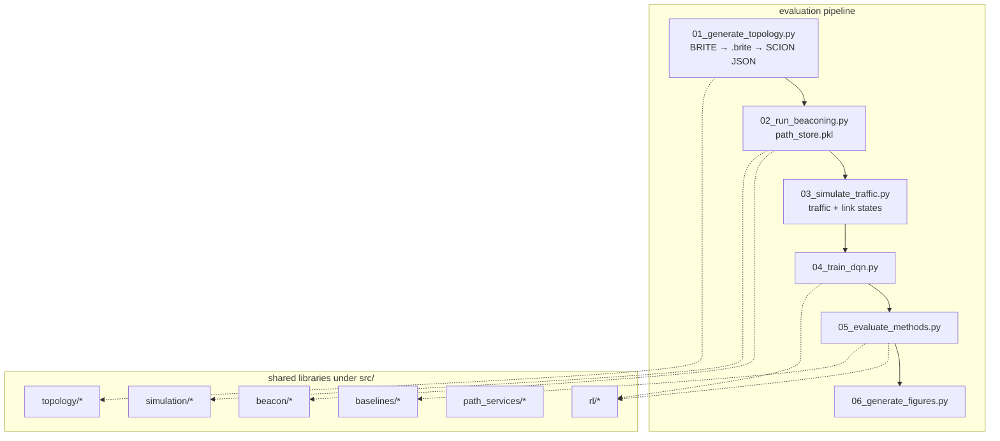

# Codebase walkthrough

This document explains how the **SCION DQN simulation** repository is structured, how major pieces talk to each other, and where to look when you extend or fix things. It reflects the tree as of this writing; some paths are still evolving (see [Known gaps](#known-gaps)).

---

## What this project is trying to do

1. **Build or synthesize** an AS-level network topology (often via **BRITE**, sometimes via a **mock dense graph** in Python).
2. **Approximate SCION control-plane behavior** (beaconing, path discovery) so you get candidate paths between ASes.
3. **Simulate traffic and link conditions** over time.
4. **Train and evaluate** a **DQN** (and **baselines**) for **path selection** under **selective probing** (different probe costs, not probing every path).

The code is organized in layers: **topology generation** (`src/topology/`, BRITE), **simulation + RL** (`src/simulation/`, `src/beacon/`, `src/rl/`, `src/baselines/`), and **evaluation drivers** (`evaluation/*.py`) that form the main numbered pipeline.

---

## Big picture: evaluation-driven workflow

For RL training and paper-style experiments, the supported path is the **numbered scripts under `evaluation/`** (orchestrated by `run_full_evaluation.py`).




| Entry point                           | Role                                                                                                                             |
| ------------------------------------- | -------------------------------------------------------------------------------------------------------------------------------- |
| `evaluation/run_full_evaluation.py`   | Runs `01`–`06` in order with a timestamped `evaluation/run_*` directory.                                                         |
| `evaluation/run_full_evaluation_2.py` | Alternate pipeline using mock dense setup (`01_setup_dense_topology.py`) and different figure script; same “numbered step” idea. |


Evaluation uses `**scion_topology.json**` (NetworkX node-link) plus run-scoped pickles (`path_store.pkl`, `link_states.pkl`, etc.). Older **pandas `topology.pkl`** + `link_table.parquet` flows still exist under `src/` for reuse (e.g. `BRITE2SCIONConverter.convert()`, traffic engine) but are not wired through a Typer CLI anymore.

---

## Repository layout


| Path                         | Purpose                                                                                                                                                                                                            |
| ---------------------------- | ------------------------------------------------------------------------------------------------------------------------------------------------------------------------------------------------------------------ |
| `external/brite/`            | Git submodule: Boston University **BRITE** topology generator (Java). Built with `./setup_brite.sh` into `Java/Brite.jar`.                                                                                         |
| `configs/brite_templates/`   | Example `.conf` files matching BRITE’s numeric parser (used as reference; generator code builds equivalent text).                                                                                                  |
| `evaluation/`                | **End-to-end experiment drivers**: topology → beaconing → traffic → train → evaluate → figures. Each script usually accepts `run_DIR` as argv.                                                                     |
| `src/topology/`              | BRITE **config generation** (`brite_cfg_gen.py`), **BRITE → SCION-ish graph** (`brite2scion_converter.py`).                                                                                                        |
| `src/beacon/`                | `**beacon_sim_v2.py`**: beacon simulation over `**topology.pkl`** (node/edge DataFrames).                                                                                                                          |
| `src/traffic/`               | `**traffic_engine.py**`: traffic matrix generation tied to topology pickles / memmaps.                                                                                                                             |
| `src/link_annotation/`       | `**capacity_delay_builder.py**`: annotate links from topology pickle.                                                                                                                                              |
| `src/path_services/`         | `**pathfinder_v2.py**`, `**pathprobe.py**`: path representation, probing metrics (used by harness / RL-style flows).                                                                                               |
| `src/harness/`               | `**algo_harness.py**`: optional benchmark harness for path algorithms (pickle topology + memmaps); not used by the evaluation scripts.                                                                             |
| `src/baselines/`             | Individual selectors: shortest path, widest, ECMP, random, SCION default, wrappers.                                                                                                                                |
| `src/rl/`                    | DQN agents (`dqn_agent_enhanced.py`, `evaluation/dqn_agent.py`), **Gym-style** envs (`environment_*.py`), **selective probing** stack (`environment_selective_probing.py`, `selective_probing_agent.py`, rewards). |
| `src/visualization/`         | Topology visualization helpers.                                                                                                                                                                                    |
| `src/example_usage.py`       | Small scripted example (may reference older package names in places).                                                                                                                                              |
| `pyproject.toml` / `uv.lock` | **uv**-first packaging; `uv sync --extra dev` installs the `src` package in editable mode.                                                                                                                         |


---

## External tool: BRITE

- **Submodule**: `external/brite` (see `.gitmodules`).
- **Setup**: `./setup_brite.sh` checks Java, initializes the submodule, runs `make` in `Java/`, then `**jar cfe`** to build `Java/Brite.jar` (upstream Makefile only compiles classes).
- **Invocation contract**: `Main.Brite` expects **three** arguments: `config.conf`, **output path without `.brite` suffix**, and `**Java/seed_file`**. BRITE writes `**<stem>.brite`**.
- **Python side**: `BRITEConfigGenerator` writes a valid **numeric** BRITE config; `BRITERunner` (fallback in `brite_cfg_gen.py`) shells out to the JAR with the seed path. `evaluation/01_generate_topology.py` does the same for the evaluation pipeline.

---

## Evaluation pipeline (deep dive)

All steps share a directory like `evaluation/run_YYYYMMDD_HHMMSS/`. `run_full_evaluation.py` creates it and passes it into each script.

### Step 1 — `01_generate_topology.py`

1. `**BRITEConfigGenerator`** writes `brite_config.conf` (model codes such as AS Barabási–Albert / BA-2, `N`, bandwidth distribution, etc.).
2. `**run_brite()`** runs the JAR; consumes `**topology`** stem → produces `**topology.brite**`.
3. `**BRITE2SCIONConverter.convert_brite_file()**` reads the BRITE export, assigns **ISDs** (k-means on coordinates for multi-ISD; single ISD for small graphs), picks **core ASes**, adds **virtual edges** for connectivity / diversity, **classifies links**, and returns a dict with:
  - `**graph`**: `networkx` graph (node attrs include `isd`, `x`, `y`; edges have `type`, `latency`, `bandwidth`),
  - `**isds`**: list of `{isd_id, member_ases}`,
  - `**core_ases`**: set of AS ids.
4. Optional **extra peering** edges are added in the script for denser graphs.
5. Writes `**scion_topology.json`** (node-link graph + metadata) and `**scion_topology.pkl`**.

**Downstream contract**: later steps load `**scion_topology.json`** for dict/json usage.

### Step 2 — `02_run_beaconing.py`

- Loads `**scion_topology.json`**, rebuilds `**networkx`** graph, builds a `**topology**` dict for the simulator.
- Intended to run `**SCIONSimulator**` from `**src.simulation.scion_simulator**` and `**InMemoryPathStore**` from `**src.simulation.path_store**`.
- Saves `**path_store.pkl**` and `**selected_pair.json**` (src/dst AS, path count, etc.).

### Step 3 — `03_simulate_traffic.py`

- Reads topology, **selected pair**, `**path_store.pkl`**, generates 28 days of flow samples (hourly), builds `**traffic_flows.pkl`** and `**link_states.pkl**` for the same run directory.

### Step 4 — `04_train_dqn.py`

- Loads topology JSON, pair, path store, traffic, link states.
- Builds `**SelectiveProbingSCIONEnv**` (extends `**RealisticSCIONPathSelectionEnv**`) with probe cost parameters.
- Trains `**EnhancedDQNAgent**`; saves `**dqn_model.pth**`.

Imports also reference modules such as `**state_extractor_enhanced**` and `**reward_calculator_probing**`—verify they exist on your branch before relying on this script unchanged.

### Step 5 — `05_evaluate_methods.py`

- Reloads environment and checkpoint; runs **DQN** vs **baselines** on evaluation-period flows.
- Imports like `**src.baselines.baseline_algorithms`** may aggregate selectors; your tree might expose the same selectors as **individual files** under `src/baselines/` instead—reconcile imports when wiring this step.

### Step 6 — `06_generate_figures.py`

- Reads `**evaluation_results.json`** (and related artifacts) and writes **PDFs** for the paper-style figures.

### Alternate path — `01_setup_dense_topology.py` + `run_full_evaluation_2.py`

- **Pure Python** “tiered” topology (core / tier1 / tier2) with **synthetic beaconing** and path diversity selection—**no BRITE JAR**.
- Writes `**dense_*.pkl`** / `**dense_config.json`** instead of BRITE outputs. Step 2 onward must agree on filenames and shapes; today `**run_full_evaluation_2.py`** still calls `**02_run_beaconing.py**`, which expects `**scion_topology.json**`. Treat this branch as **integration-in-progress** unless you add a translation layer.

---

## Library packages under `src/`

### Topology (`src/topology/`)


| Module                     | Responsibility                                                                                                                                                                                          |
| -------------------------- | ------------------------------------------------------------------------------------------------------------------------------------------------------------------------------------------------------- |
| `brite_cfg_gen.py`         | Valid BRITE `**.conf`** text; `**BRITERunner`** to execute BRITE.                                                                                                                                       |
| `brite2scion_converter.py` | Parse `**.brite`** topology text → **NetworkX**; ISD/core/virtual link logic; `**convert()`** → pickle with **nodes/edges DataFrames**; `**convert_brite_file()`** → dict for **evaluation JSON** path. |


**Interaction**: CLI `**generate`** uses `**convert()`**; evaluation `**01`** uses `**convert_brite_file()**`.

### Beacon (`src/beacon/beacon_sim_v2.py`)

- Loads `**topology.pkl**` with `**nodes` / `edges**` DataFrames.
- Simulates **core** and **intra-ISD** beacon phases, tracks **PCBs** and **interface IDs**, writes segment-like outputs under a run directory.

**Interaction**: Designed for the **CLI / pickle** world, not directly for `**scion_topology.json`**.

### Traffic (`src/traffic/traffic_engine.py`)

- `**TrafficEngine`**: time-slotted traffic generation from topology pickle paths.
- `**LinkMetricBuilder`**: derives per-link metrics from traffic memmaps + topology.

**Interaction**: Consumes `**topology.pkl`** and `**link_table.parquet`** in the CLI `simulate` flow.

### Link annotation (`src/link_annotation/capacity_delay_builder.py`)

- Consumes topology pickle, produces **annotated link table** (e.g. Parquet) for later stages.

### Path services (`src/path_services/`)

- `**pathprobe.py`**: models **path metrics** and probing cost.
- `**pathfinder_v2.py`**: `**SCIONPath`**, `**PathFinderV2**`—segment-aware path enumeration from topology + segment store + link table.

**Interaction**: `**algo_harness.py`** wires algorithms to `**PathFinder`** / `**PathProbe`** (check import paths vs `pathfinder_v2`).

### Harness (`src/harness/algo_harness.py`)

- `**PathSelectionAlgorithm**` ABC; `**AlgorithmHarness**` runs Monte Carlo flows, records `**FlowResult**` statistics, can load algorithms by name from config.

**Interaction**: Benchmark layer on top of **path_services**; parallel to the **evaluation/** scripts but not identical.

### Baselines (`src/baselines/`)

- One module per policy (shortest, widest, lowest latency, ECMP, random, SCION default, probing wrappers).

**Interaction**: `**05_evaluate_methods.py`** expects a **registry**-style import; individual modules are ready for custom glue.

### RL (`src/rl/`)


| Area             | Files (representative)                                                                            |
| ---------------- | ------------------------------------------------------------------------------------------------- |
| **Agents**       | `dqn_agent_enhanced.py`, `evaluation/dqn_agent.py`, `selective_probing_agent.py`                  |
| **Environments** | `environment_realistic.py` ← `environment_selective_probing.py` ← probing costs / adaptive probes |
| **Rewards**      | `reward_with_probing.py`                                                                          |
| **State**        | `state_enhanced.py`                                                                               |
| **Gymnasium**    | `evaluation/environment.py`, `environment_fixed_source.py` (import `**gymnasium`**)               |


Gymnasium **API**: `reset` returns `(observation, info)` and `step` returns `(obs, reward, terminated, truncated, info)`. For `SCIONPathSelectionEnvFixedSource` (and subclasses), `source_as` / `dest_as` may be passed as `reset(options={...})` or as keywords `reset(source_as=..., dest_as=...)` for compatibility.

**Interaction chain for DQN training**: **topology + path_store + link_states + traffic_flows** → **environment** → **agent** → checkpoint.

## Configuration and environment

- **Python**: Prefer `**uv sync --extra dev`** from repo root; use `**uv run python ...`** inside `evaluation/` for scripts.
- **Java**: Required for BRITE (`./setup_brite.sh`).
- **YAML**: Under `src/config/` for simulator / traffic settings (`sim.yml`, `traffic.yml`, etc.) if you extend those modules.

---

## Known gaps (read this before a big refactor)

These are common tripping points when “making the repo run end-to-end”:

1. **Two topology shapes** — `**convert()`** (DataFrames + pickle) vs `**convert_brite_file()`** (NetworkX + JSON). Pick one canonical representation or add explicit converters.
2. **Evaluation imports** — `04_train_dqn.py` / `05_evaluate_methods.py` should stay aligned with `src/rl` and `src/simulation`; grep those imports before a demo run.
3. `**01_setup_dense_topology.py`** — fixed internal `**n_core` / `n_tier1`** counts assume **large `n_ases`**; small values go negative unless you retune the split.

---

## How to improve it (practical order)

1. **Single topology model** — Define one schema (e.g. `TopologyBundle` with graph + isds + core + optional DataFrames) and functions `**to_json` / `from_pickle`** shared by `evaluation/` and any pickle-based tools.
2. **Tests** — Extend `**src/test_basic.py`** (and pytest) to cover: BRITE conf round-trip, a tiny BRITE run, `**convert_brite_file`** on fixture `.brite`, one RL env `reset`/`step` with fake data.
3. **Pipeline 2** — Either generate `**scion_topology.json`** from dense mock setup or give `**02_run_beaconing`** a branch on input format.
4. **Observability** — Replace `subprocess.run(..., capture_output=True)` silent failures in `**run_full_evaluation.py`** with streaming logs or log files under `run_`*.

---

## Quick reference: artifact flow (evaluation / BRITE path)

```text
brite_config.conf
topology.brite          ← BRITE JAR (+ seed_file)
scion_topology.json     ← BRITE2SCIONConverter + peering tweaks
scion_topology.pkl
path_store.pkl          ← intended: beaconing / path discovery
selected_pair.json
traffic_flows.pkl       ← traffic simulation
link_states.pkl
dqn_model.pth           ← training
evaluation_results.json ← baselines + DQN
figure*.pdf             ← plotting
```

---

## Suggested reading order for new contributors

1. `README.md` — install and high-level commands.
2. `evaluation/run_full_evaluation.py` — orchestration.
3. `evaluation/01_generate_topology.py` — BRITE glue + JSON contract.
4. `src/topology/brite2scion_converter.py` — `**convert_brite_file**` vs `**convert**`.
5. `src/rl/environment_selective_probing.py` — what the RL agent “sees.”
6. `src/beacon/beacon_sim_v2.py` — control-plane-ish simulation over DataFrames.
7. `src/harness/algo_harness.py` (optional) — benchmark harness for algorithms against pickle topologies + memmaps; not required for `evaluation/`.

This should give you a mental model of **who calls whom**, **which file formats move between steps**, and **where the fragile boundaries** are when you extend the simulator or the learning stack.