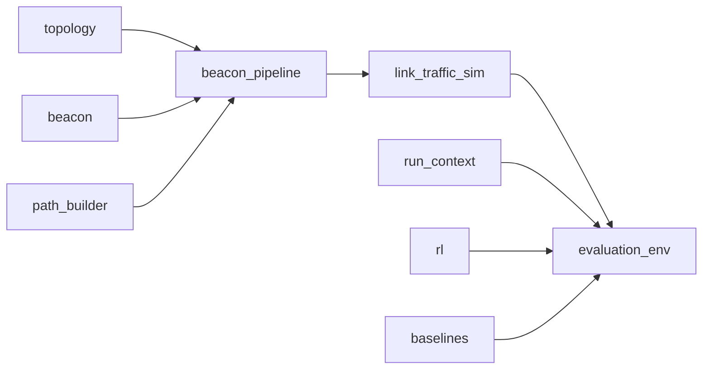

# `src/` — SCION simulation and path-selection library

Python package for the SCION AS-level simulator. Numbered scripts in [`evaluation/`](../evaluation/) are thin CLIs; implementation lives here.

**Orchestration:** [`pipeline/`](pipeline/) (run directories, figure styling). **Integration hub:** [`simulation/`](simulation/) (topology load, beaconing, traffic, RL/baseline environment).

---

## Evaluation pipeline map

| Step | Script | `src` modules | Artifacts under `<run>/` |
|------|--------|---------------|---------------------------|
| 01 | `01_generate_topology.py` | `topology.*`, `simulation.run_context` | `topology/scion_topology.json`, BRITE outputs |
| 02 | `02_run_beaconing.py` | `simulation.beacon_pipeline`, `beacon.beacon_sim` | `path_store.json`, `selected_pair.json`, `beacon_output/` |
| 03 | `03_simulate_traffic.py` | `simulation.link_traffic_sim`, `traffic_config`, `traffic_metrics` | `link_states.pkl`, `traffic_flows.pkl`, `traffic_inspection.json` |
| 04 | `04_train_*.py` | `rl.path_selection_train`, DQN agents | `dqn_*_model.pth` |
| 05 | `05_evaluate_methods.py` | `simulation.evaluation_env`, `baselines.*`, `rl.*` | `evaluation_results.json` |
| — | `eval_multi_reward_comparison.py` | same + `rl.reward_profiles` | `multi_reward_comparison.json` |
| 06 | `06_generate_figures.py` | `pipeline.figures` | `figures/*.png` |
| — | `inspect_traffic.py` | `simulation.traffic_inspect` | stdout QC report |



**Run layout:** Topology must live at `<run>/topology/scion_topology.json` (step 01). Path store is JSON (`path_store.json`). Traffic state is pickle (`link_states.pkl`).

---

## [`simulation/`](simulation/)

| Module | Role |
|--------|------|
| **`run_context.py`** | `topology_dir()`, `load_topology_graph()`, `load_run_context()`, `make_env()`, `validate_pre_training_artifacts()`, `compute_action_dim()`, `compute_goodput_cap()`. |
| **`beacon_pipeline.py`** | Step 02: `run_beaconing()`, `discover_paths_for_topology()` → `path_store.json`, `selected_pair.json`. |
| **`path_builder.py`** | `build_paths_for_pair()`, `build_scion_paths_for_pair()` (Up/Core/Down + peering). |
| **`path_store.py`** | `InMemoryPathStore` JSON persistence. |
| **`link_traffic_sim.py`** | Step 03: 28-day hourly traffic, per-link aggregation, ECMP splits. |
| **`traffic_config.py`** | `TrafficSimConfig` (sparse pairs, calibrated demand; `TRAFFIC_*` env overrides). |
| **`traffic_metrics.py`** | Vectorized link/path congestion metrics. |
| **`traffic_inspect.py`** | `analyze_traffic_run()`, `format_traffic_report()`. |
| **`evaluation_env.py`** | **`EvaluationPathSelectionEnv`** for steps 04–05. Observations: **flat** `FLAT_GLOBAL_DIM=5`, **scoring** `SCORING_GLOBAL_DIM=7` + `PATH_FEATURE_DIM=7` per path, **conditional** `CONDITIONAL_SCORING_GLOBAL_DIM=12`. |

---

## [`topology/`](topology/) — step 01

| Module | Role |
|--------|------|
| **`eval_config.py`** | Loads [`evaluation/topology_defaults.yaml`](../evaluation/topology_defaults.yaml); `run_brite_topology_generation()`. |
| **`brite_cfg_gen.py`** | `BRITEConfigGenerator`, `run_brite()` subprocess. |
| **`brite2scion_converter.py`** | `BRITE2SCIONConverter` — ISD assignment, cores, SCION graph JSON. |
| **`topology_geo.py`** | Geographic layout, inter-ISD core ring, latency from coordinates. |

---

## [`beacon/`](beacon/) — control plane

| Module | Role |
|--------|------|
| **`beacon_sim.py`** | `BeaconSimulator`: core-mesh + top-down intra-ISD PCBs; peer links excluded from beacon propagation. |

Used via `simulation.beacon_pipeline` only.

---

## [`rl/`](rl/) — DQN training and inference

| Module | Role |
|--------|------|
| **`path_selection_train.py`** | `train_flat_dqn()`, `train_scoring_dqn()`, `train_conditional_scoring_dqn()`; `ScoringHyperparams`. |
| **`dqn_agent_simple.py`** | Flat MLP DQN. |
| **`dqn_agent_enhanced.py`** | Attention + PER + Double DQN (`EnhancedDQNConfig`). |
| **`dqn_agent_scoring_simple.py`** | Per-path Q, variable path count. |
| **`dqn_agent_scoring_enhanced.py`** | Dueling path-scoring DQN (recommended). |
| **`dqn_agent_scoring_conditional.py`** | Same architecture; global state includes reward weights. |
| **`reward_profiles.py`** | Named `RewardProfile` presets for multi-objective training/eval. |

**Checkpoints**

| Script | File |
|--------|------|
| `04_train_dqn.py` | `dqn_model.pth` |
| `04_train_simple_dqn.py` | `dqn_simple_model.pth` |
| `04_train_scoring_dqn.py` | `dqn_scoring_simple_model.pth` |
| `04_train_scoring_enhanced_dqn.py` | `dqn_scoring_enhanced_model.pth` |
| `04_train_conditional_dqn.py` | `dqn_conditional_scoring_model.pth` |

---

## [`baselines/`](baselines/) — step 05 heuristics

Each selector implements `select_path(paths, metrics, flow, state) -> int`:

| Module | Class | Policy |
|--------|-------|--------|
| `shortest_path.py` | `ShortestPathSelector` | Min hops |
| `widest_path.py` | `WidestPathSelector` | Max bottleneck bandwidth |
| `lowest_latency.py` | `LowestLatencySelector` | Min latency |
| `ecmp.py` | `ECMPSelector` | Shortest hops + stable hash tie-break |
| `scion_default.py` | `SCIONDefaultSelector` | Shortest then lowest latency |
| `random_selection.py` | `RandomSelector` | Uniform random |

---

## [`pipeline/`](pipeline/)

| Module | Role |
|--------|------|
| **`run_dirs.py`** | `resolve_run_dir()`, `pipeline_steps_from()`, `run_script()`, `PIPELINE_STEP_SCRIPTS`. |
| **`figures.py`** | LNCS plot style, method names/colors for step 06. |

---

## [`visualization/`](visualization/) — optional plots

| Module | Role |
|--------|------|
| **`topology_visualizer.py`** | Dashboard / geographic PNG from `scion_topology.json`. |
| **`topology_cli.py`** | `uv run python -m src.visualization.topology_cli [run_dir]` |

---

## Observation and reward model

**Flat DQN:** 5-D global state; discrete path index (masked).

**Path-scoring DQN:** `{"global": (7,), "paths": (N, 7)}` with normalized `(src, dst)` in global.

**Conditional scoring:** 12-D global (7 + encoded `RewardWeights`).

**Reward:** `RewardWeights` + `EvaluationPathSelectionEnv.compute_reward()` — goodput, trust, probing penalty (`w_probe`).

---

## Environment variables (common)

| Variable | Effect |
|----------|--------|
| `EVAL_BRITE_N_NODES` | Override BRITE size (step 01) |
| `DQN_TRAIN_EPISODES` | Fixed training episode count |
| `DQN_LR`, `DQN_GAMMA`, `DQN_HIDDEN_DIM`, … | Scoring/flat hyperparameters |
| `BEACON_MAX_SEGMENTS_PER_ORIGIN`, `BEACON_MAX_INTRA_QUEUE_POPS` | Beacon fan-out |
| `TRAFFIC_*` | `TrafficSimConfig.from_env()` |
| `TRAFFIC_WRITE_JSON=1` | Optional large `link_states.json` |

---

## Extending the codebase

**New baseline:** add `select_path` in `baselines/`, register in `evaluation/05_evaluate_methods.py`, optional entry in `pipeline/figures.py`.

**New DQN:** match agent API used in `path_selection_train.py`; add `04_train_*.py` and checkpoint loading in step 05.

**Traffic changes:** edit `TrafficSimConfig` / `link_traffic_sim.py`, then re-run steps **03** and **04** (new `link_states.pkl`).

---

## Tests

```bash
uv sync --extra dev
uv run python -m pytest tests/
```

See [`tests/`](../tests/) for package coverage.

---

## Related docs

- [`README.md`](../README.md) — install and full pipeline quick start
- [`AGENTS.md`](../AGENTS.md) — contributor guidelines
